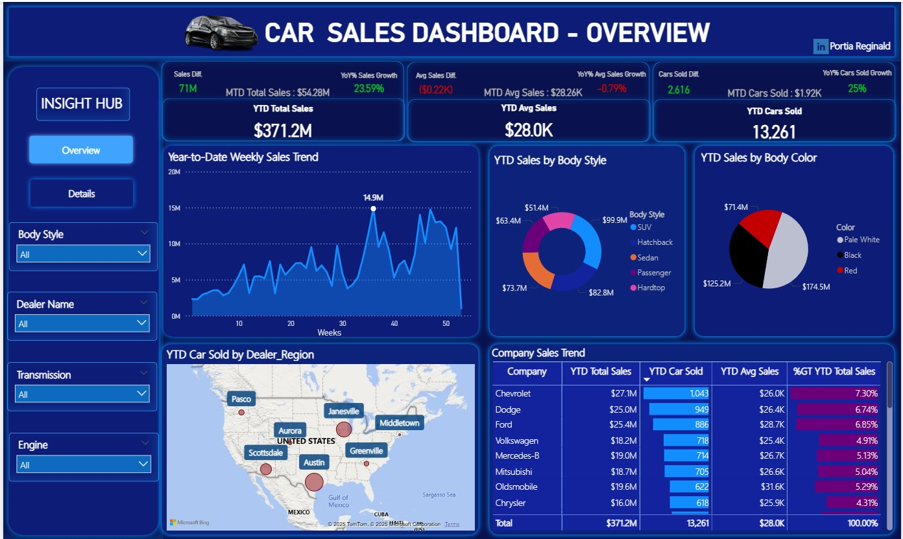
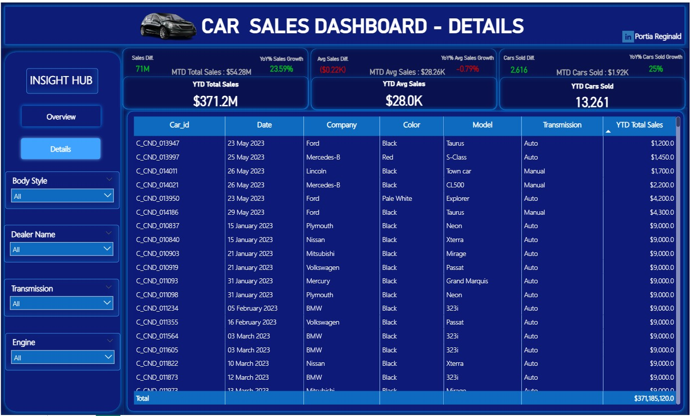

# **🚗CAR SALES ANALYSIS PROJECT**

This project presents a detailed analysis of car sales data using Power BI, with an emphasis on time intelligence, growth tracking, and sales performance monitoring. It demonstrates how business insights can be derived from raw data through proper modeling, DAX calculations, and visualization design.

## **📁Project Overview**

The client wanted a comprehensive dashboard that could clearly show how the company’s car sales were performing across different models, colors, regions, and manufacturers. The dashboard was designed to provide both a high-level summary and the ability to drill down into details, making it a valuable management and decision-making tool.

The analysis uses DAX time intelligence functions to calculate year-to-date (YTD) and month-to-date (MTD) performance metrics. It combines analytical accuracy with visual storytelling, giving the client a single, dynamic view of their entire sales operation.

## **🎯Project Objectives**

The primary goals of this analysis were to:

- Evaluate sales performance by comparing current and previous periods.

- Understand which car body styles, colors, and manufacturers generate the most revenue.

- Identify the best and least performing dealer regions.

- Assess how monthly sales trends influence overall business performance.

- Deliver insights that can guide sales strategy, product distribution, and dealer management decisions.

## **🧩Data Modeling and Preparation**

The dataset contained a single table — the Car Sales Data table — with fields such as Date, Dealer, Manufacturer, Car Model, Transmission, Body Style, Color, Engine Type, and Total Sales.

To enable accurate time-based analysis, a Calendar Table was created using the DAX CALENDAR() function, covering the minimum and maximum dates in the dataset. From this table, additional columns for Month, Year, and Week were created.

The Date column from the Calendar Table was used as the primary key, and it was connected to the Date column in the Car Sales Data Table as the foreign key. This relationship enabled all time intelligence functions to work correctly and allowed metrics such as YTD and MTD to calculate seamlessly.

Data cleaning and transformations were done in Power Query, ensuring the dataset was properly formatted before analysis.

## **🧠Tools and Techniques**

- Power BI: for building visuals and calculating DAX measures

- Power Query: for data cleaning and preparation

- DAX (Data Analysis Expressions): for time-based calculations

- Data Modeling: to define relationships between tables

- Interactive Slicers and Navigation Buttons: for detailed exploration of metrics

## 📊 Key Metrics

- YTD Total Sales: $371.2M
  - This represents the total car sales revenue generated from the start of the year up to the current reporting date.

- MTD Total Sales: $54.28M
    - This shows the total value of sales recorded for the current month alone.

- YoY Sales Growth: +23.59%
    - This measures the percentage increase in sales compared to the same period in the previous year, showing steady year-over-year improvement.

- Sales Difference: +$71M
  - This represents the absolute increase in total revenue compared to the previous year’s performance.

- YTD Average Sales: $28.0K
  - This reflects the average amount earned per car sold throughout the year.

- MTD Average Sales: $28.26K
  - This shows the average sale value per car for the current month, indicating a consistent transaction size.

- Average Sales Difference: -$0.22K
  - This indicates a slight drop in the average sale value per car compared to the previous year.

- YTD Cars Sold: 13,261
  - This represents the total number of cars sold during the current year.

- MTD Cars Sold: 1,920
  - This shows the number of cars sold in the current month.

- Cars Sold Difference: +2,616
  - This measures the increase in units sold compared to the previous year.

- MTD Cars Sold:$1.92k
  - This shows the total number of cars sold in the current month alone.

OVERVIEW                                                                           |  DETAILS
:--------------------------------------------------------------------------------: | :-------------------------------------------------------------------------------------:
                                                                  |    

## **📈Key Insights and Findings**

1. Sales Performance Over Time:

   - Total year-to-date (YTD) sales reached $371.2 million, marking a clear improvement over the previous year, with an increase of $71 million in revenue and 23.59% year-over-year growth. The total number of cars sold also increased significantly from 10,645 to 13,261 units, showing that the company’s sales performance is both strong and consistent.

2. Body Style Analysis:

   - Among car types, Hatchbacks achieved the highest YTD sales value of $82.8 million, making them the top-performing body style. Hardtops recorded the lowest sales at $51.4 million, suggesting reduced consumer interest in that category.

3. Color Preference:

   - In terms of color, Pale White cars generated the highest sales at $174.5 million, followed closely by Red cars at $125.2 million. These results indicate a customer preference for neutral and bold tones, which should guide future production and inventory strategies.

4. Regional Performance:

   - Regional analysis revealed that Austin recorded the highest number of cars sold (2,296 units) and the highest total sales value of $65 million. In contrast, Middletown had the lowest performance, selling 1,722 cars and generating $47.6 million in sales. These findings highlight Austin as a key sales hub, while Middletown may require targeted sales or promotional support to boost performance.

5. Manufacturer Analysis:

   - Among car brands, Chevrolet led in both total sales and cars sold, generating $27.1 million and selling 1,043 units. Dodge ($25 million) and Ford ($24.5 million) followed closely behind.
On the lower end, Jaguar recorded the least performance, contributing only $2.5 million in total sales with 102 cars sold.

6. Weekly and Monthly Sales Trends:

   - Sales trends across the year showed consistent upward movement, with noticeable peaks in certain weeks, reaching as high as $14.9 million in weekly sales. This consistency indicates strong customer demand throughout the year rather than isolated spikes.

**Click the image below to watch the full project walkthrough⬇️.**

## **💼Business Impact**

This dashboard provides the client with a single, reliable view of their car sales performance. They can now monitor sales growth, unit movement, and average transaction values at any time of the year.
The insights allow them to identify which car models and colors drive the most revenue, which dealers are performing best, and where there is room for operational or marketing improvement.

By highlighting sales differences, top contributors, and regional performance, the report enables management to make more informed decisions about production planning, inventory allocation, and dealer engagement.
It transforms previously static sales records into actionable intelligence that supports strategic and data-driven business decisions.

## **🧭Key Learnings**

Working on this project deepened my understanding of how to apply DAX time intelligence in practical business analysis. I learned how to calculate and interpret YTD, MTD, and YoY metrics in a way that aligns with real-world performance measurement.
I also strengthened my skills in data modeling, particularly in creating a Calendar Table and establishing correct relationships that allow accurate time-based aggregation.

Building this report also improved my understanding of how to design interactive dashboards, create dynamic KPIs, and use visual cues to make business trends and performance insights easier to interpret.

## **🏁Conclusion**

This project connected data modeling, DAX, and visualization to form a complete business analysis solution.
By comparing current performance to previous periods, it delivers actionable intelligence for business leaders to assess growth, set goals, and refine sales strategies.

## **📩Contact Me**

Feel free to reach out via

- My E-mail: portiareginald06@gmail.com

- My LinkedIn: [Portia Reginald Anrulika](https://www.linkedin.com/in/portia-reginald-13103719a?utm_source=share&utm_campaign=share_via&utm_content=profile&utm_medium=android_app)
